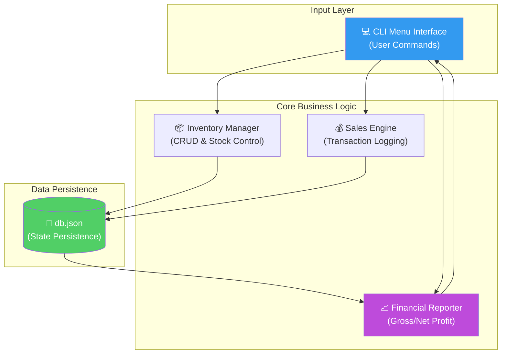
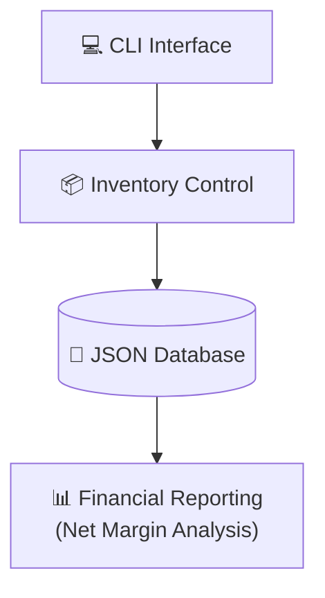

# 🥬 VeganShop: Operational Control & Inventory Intelligence Engine

<p align="center">
  
  
  
  
  
</p>

**VeganShop** è un sistema di gestione operativa progettato per automatizzare il controllo dell'inventario e l'analisi finanziaria di un esercizio commerciale. Il progetto implementa una logica di business complessa in Python, integrando funzionalità di tracciamento dello stock, registrazione delle vendite in tempo reale e calcolo automatico della marginalità (lorda e netta), fornendo una visione chiara della salute economica del business attraverso un'interfaccia CLI snella e robusta.

## 🏢 Valore Enterprise & Settori di Applicazione

| Settore / Ambito | Rilevanza & Benefici |
|-------------------|-----------|
| **Retail & Inventory Management** | Automazione del carico/scarico merce e monitoraggio proattivo dei livelli di stock per evitare rotture di stock. |
| **SME Business Intelligence** | Calcolo immediato dei profitti netti sottraendo i costi di acquisizione, facilitando il monitoraggio del ROI per singolo prodotto. |
| **Warehouse Operations** | Gestione semplificata delle anagrafiche prodotto con persistenza dei dati cross-sessione per piccoli magazzini o depositi. |
| **POS System Prototyping** | Pattern architetturale ideale per il back-end di sistemi Point-of-Sale (POS) moderni e scalabili. |

---

## 🎯 Executive Summary & Valore di Business
VeganShop risolve l'inefficienza della gestione manuale delle scorte, garantendo l'integrità dei dati e la precisione del reporting finanziario.

### 🏛️ 1. Inventory Logic & Stock Enforcement
* **Automated Stock Deduct:** Ogni vendita registrata aggiorna istantaneamente il database locale, con controlli preventivi che impediscono vendite superiori alla disponibilità fisica (Stock-Out Prevention).
* **Replenishment Strategy:** Funzionalità di rifornimento intelligente che permette di incrementare le quantità di prodotti esistenti preservando le configurazioni di prezzo originali, riducendo l'attrito operativo.

### ⚙️ 2. Financial Intelligence (Gross vs Net)
* **Real-Time Profit Calculation:** Il sistema non si limita a sommare i ricavi. Implementa algoritmi che correlano ogni vendita al costo di acquisto storico del prodotto, permettendo il calcolo del profitto netto reale (Marginalità Industriale).
* **Catalogo Dinamico:** Visualizzazione strutturata del listino che funge da cruscotto operativo per il management, evidenziando prezzi di mercato e livelli di giacenza.

### 🛡️ 3. Software Quality & Data Integrity
* **JSON Persistence:** Utilizzo del formato JSON per la serializzazione dello stato del negozio, garantendo una persistenza leggera, leggibile dall'uomo e facilmente integrabile con altri sistemi.
* **Error Recovery:** Implementazione di blocchi `try-except` e validazioni di tipo per gestire input utente anomali, assicurando che il database non venga mai corrotto da inserimenti errati.

---

## 🏗️ Architettura della Logica di Business



## 🛠️ Stack Tecnologico

| Layer | Tecnologia | Ruolo |
|:------|:-----------|:-----|
| 🐍 **Language** | Python 3.8+ | Core development |
| 🏗️ **Architecture** | OOP / Functional | Business Logic Structure |
| 📂 **Persistence** | JSON (native lib) | Lightweight Document Store |
| 📊 **Analytics** | Arithmetic Logic | Financial KPI calculation |

## 🚀 Setup & Utilizzo

```bash
# Clone
git clone https://github.com/sylver86/18-vegan-store-management-python.git
cd 18-vegan-store-management-python

# Esecuzione
python main.py
```

**Funzionalità Chiave:**
1. **Aggiungi prodotto:** Inserimento nuove referenze (Prezzo acquisto/vendita).
2. **Lista prodotti:** Report completo dello stock attuale.
3. **Registra vendita:** Movimentazione merce e log transazione.
4. **Profitto lordo/netto:** Analisi finanziaria istantanea.

<br><br>

*Progettato e sviluppato da Eugenio Pasqua.*

---

# 🇬🇧 ENGLISH VERSION

# 🥬 VeganShop: Operational Control & Inventory Intelligence Engine

<p align="center">
  
  
  
</p>

**VeganShop** is an operational management system designed to automate inventory control and financial analysis for a retail business. The project implements complex business logic in Python, integrating features for stock tracking, real-time sales recording, and automatic margin calculation (gross and net), providing a clear view of business health through a lean and robust CLI.

## 🏢 Enterprise Value & Application Sectors

| Sector / Domain | Relevance & Benefits |
|-------------------|-----------|
| **Retail Management** | Automated stock updates and proactive monitoring to prevent stock-outs. |
| **SME Business Intelligence** | Instant net profit calculation by subtracting acquisition costs for ROI tracking. |
| **Warehouse Ops** | Simplified product master data management with cross-session persistence. |

---

## 🏗️ Business Logic Architecture



## 🧰 Technology Stack

`Python 3.8+` · `JSON` · `OOP` · `CLI`

<br><br>

*Designed and developed by Eugenio Pasqua.*
